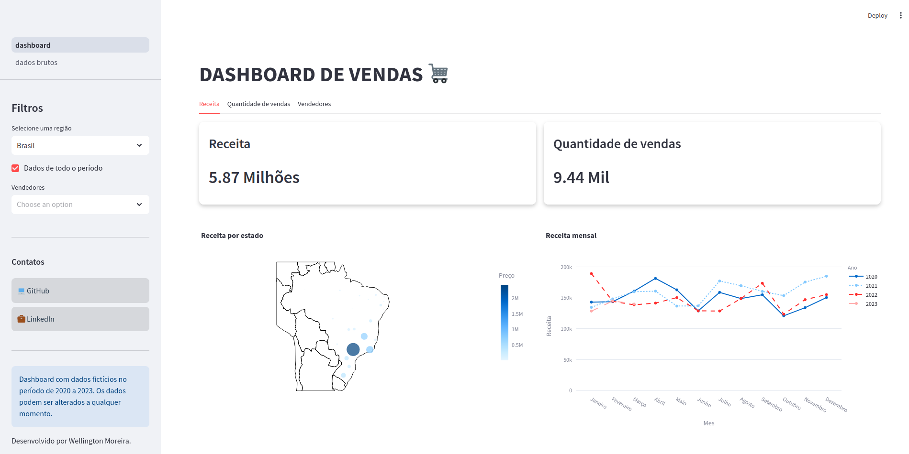
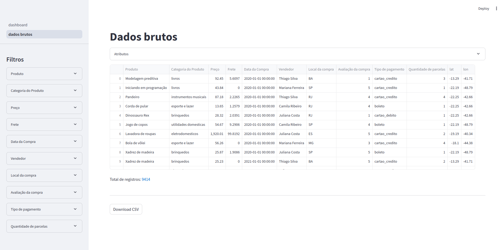

# Dashboard de Vendas



Este projeto é um dashboard interativo de visualização de vendas, desenvolvido com Streamlit, Pandas, e Plotly. Ele permite analisar as vendas de produtos em diferentes regiões, períodos, vendedores e categorias. Utiliza dados fictícios de 2020 a 2023 para fornecer insights sobre receita, quantidade de vendas e performance de vendedores.


## Estrutura do Projeto

Abaixo está a estrutura de pastas do projeto:

```
.
├── data
│   └── produtos.parquet          # Arquivo de dados no formato Parquet
├── notebooks
│   └── exploratory.ipynb         # Jupyter notebook para exploração de dados
├── README.md                     # Documentação do projeto
└── src
    ├── assets
    │   ├── image-01.png          # Imagem 1 utilizada no dashboard
    │   └── image-02.png          # Imagem 2 utilizada no dashboard
    ├── dashboard.py              # Arquivo principal do dashboard (Streamlit)
    ├── pages
    │   └── dados_brutos.py       # Página para visualização dos dados brutos
    └── services
        ├── data_processing.py    # Funções para processamento de dados
        ├── etl.py                # Funções para ETL (extração, transformação, carga)
        ├── plots.py              # Funções para criação de gráficos
        └── utils.py              # Funções auxiliares e estilos css do projeto

```

## Tecnologias

- **Streamlit**: Para construção do dashboard interativo.
- **Pandas**: Para manipulação de dados.
- **Plotly**: Para visualização de gráficos interativos.
- **Requests**: Para requisição de dados externos.

## Como Usar

### 1. Instalar Dependências

Crie e ative um ambiente virtual:

```bash
python -m venv .venv
source .venv/bin/activate  # No Windows, use .venv\Scripts\activate
```

Instale as dependências:

```bash
pip install -r requirements.txt
```

**requirements.txt** deve conter as bibliotecas necessárias para o funcionamento do projeto, como `streamlit`, `pandas`, `plotly`, `requests`, etc.

### 2. Executar o Dashboard

Após instalar as dependências, você pode iniciar o **Streamlit** para visualizar o dashboard:

```bash
streamlit run dashboard.py
```

Isso abrirá o dashboard no navegador, acessível em [http://localhost:8501](http://localhost:8501).

### 3. ETL (Extração, Transformação e Carga)

O processo de ETL é responsável por extrair dados de uma URL, transformá-los em um **DataFrame** do **Pandas** e, em seguida, salvar o arquivo **Parquet**.

Para garantir que o arquivo de dados está atualizado, o ETL pode ser executado diretamente a partir do **dashboard.py**, ou pode ser executado manualmente com a função `executa_etl()`.

### 4. Interação com o Dashboard

- **Filtros**:
  - **Região**: Permite filtrar os dados com base na localização das vendas.
  - **Ano**: Filtro de ano de 2020 a 2023.
  - **Vendedores**: Permite selecionar múltiplos vendedores.

- **Visualizações**:
  - Gráficos interativos de receita, quantidade de vendas e análises dos vendedores.

## Licença

Este projeto está licenciado sob a **MIT License**. Consulte o arquivo LICENSE para mais detalhes.

## Contato

Desenvolvido por [Wellington Moreira](https://www.linkedin.com/in/wellington-moreira-santos)

