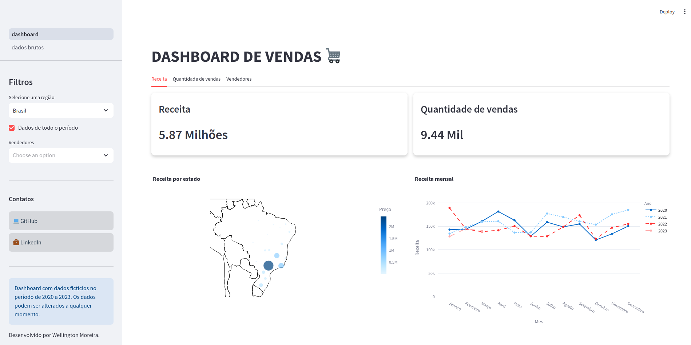
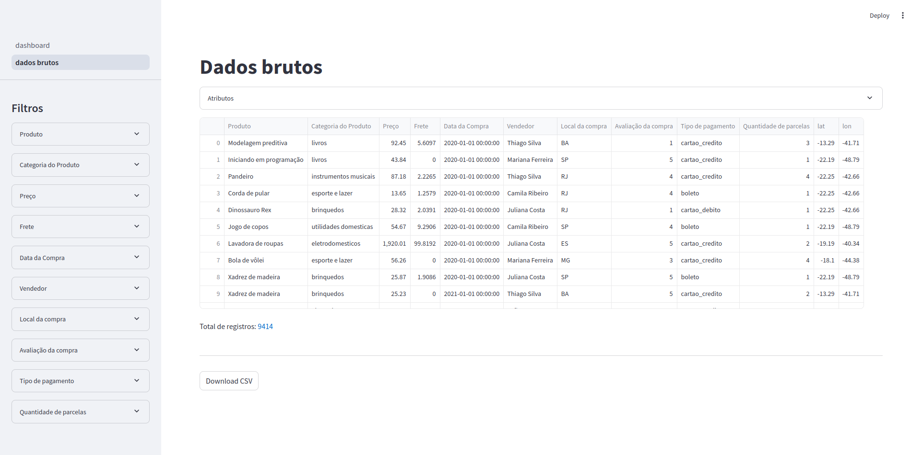

# Dashboard de Vendas

Este projeto é um dashboard interativo de visualização de vendas, desenvolvido com Streamlit, Pandas, e Plotly. Ele permite analisar as vendas de produtos em diferentes regiões, períodos, vendedores e categorias. Utiliza dados fictícios de 2020 a 2023 para fornecer insights sobre receita, quantidade de vendas e performance de vendedores.